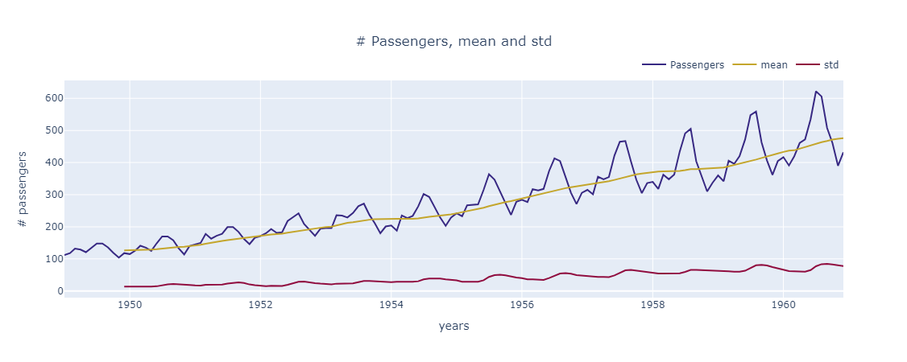
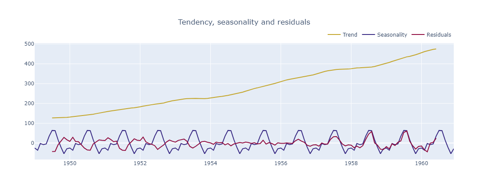
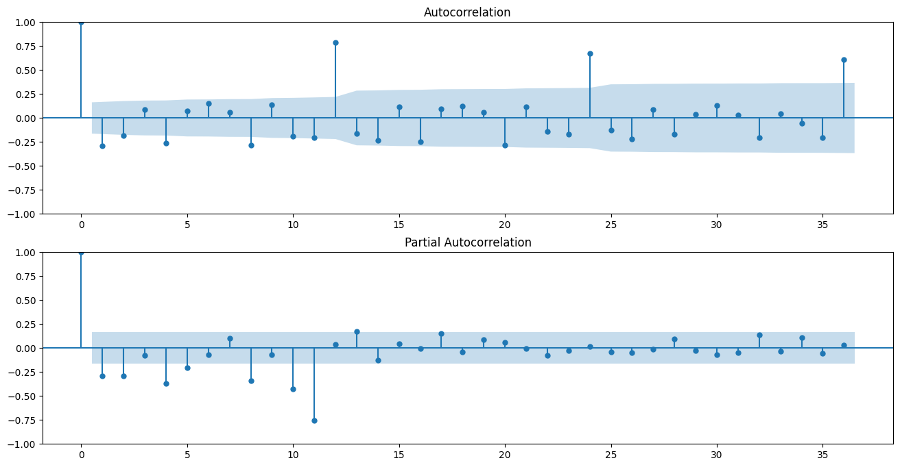
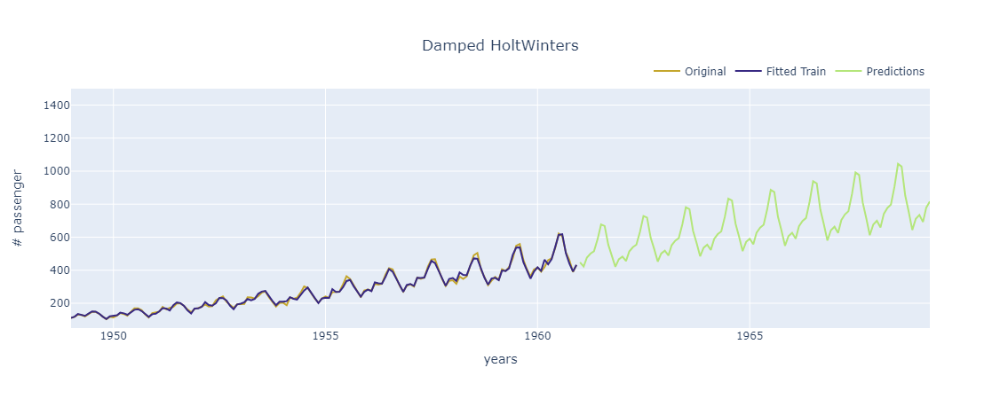

## Univariate Time-Series for Flight Passengers

The dataset corresponds to Flight Passengers, which includes year,month and passengers, being passgeners our variable to forecast. I started analyzing the behaviour of the number of passengers over time.

    

 

In order to understand better that behaviour, we decompose the number of passengers to discern seasonality, residuals and trend separated. The trend clearly goes upwards and seasonality corresponds to 12 months (yearly). Residuals is almost linear at the beginning, being at the end abrupter which means, over the years that season behaviour are more irregular.

    

 

There are 2 known methods for forecasting, which I have compared them, these are SARIMA and Holt Winters. Let's start with SARIMA ((Seasonal Autoregressive Integrated Moving Average). In order to implement this method, it requires previous validation processes in order to ensure, that data is stationary. Therefore,  the model depends on these variables (p,d,q) and (P,D,Q,s), being (3,2,2) and (0,1,0,12) respectively. These are extracted from Auto Correlation and Partial AutoCorrelation graphs, for p and q and differencing of order 2 in order to get the data stationary. For seasonality (upper case variables), these are extracted transforming the problem based on passengers/year, there is only differencing of order 1 and seasionality of 12.

    

 

This graph represents the forecast of 100 timesteps (100 months) in future using SARIMA.

    

 

| Model | Mode | R2 | MSE | MAE |
| :---:         |     :---:      |          :---: |     :---:      |     :---:      |
| SARIMA   | training     |0.855997   | 769.295380    |11.584070    | 
| SARIMA    | testing       | 0.940324     | 348.747653  | 15.089962  |

Let's begin implementing the second method, called Holt Winters. I used statsmodel for that, which integrates this method and is very straighforward to use it. I compared 2 versions of Holt Winters, without and with damping. When calling that method, I configured trend and seasonality to be in additive approach. I compared the metrics between them in order to select the best of one of the 3 methods I used (sarima, HW and HW damped). The following tables represent Holt Winters metrics.

| Model | Mode | R2 | MSE | MAE |
| :---:         |     :---:      |          :---: |     :---:      |     :---:      |
| HW   | training     |0.990575   | 50.350803    |5.722603    | 
| HW damped | training     |0.990496  | 50.773091   |5.760161    | 
| HW    | testing       |  0.770568     | 1340.813128  | 30.954065  |
| HW damped  | testing       | 0.879187    | 706.040844  | 21.980509  |

Analyzing the results, damped method is better than without damping, but SARIMA performs better in testing metrics compared to Holt Winters methods. In that case, testing metrics denote a better approach for generalizing better, because these are values not used for fitting. Due to that reason, the model selected is SARIMA.

## ANNEX A: 100-Forecast of Holt Winters damped

    

 